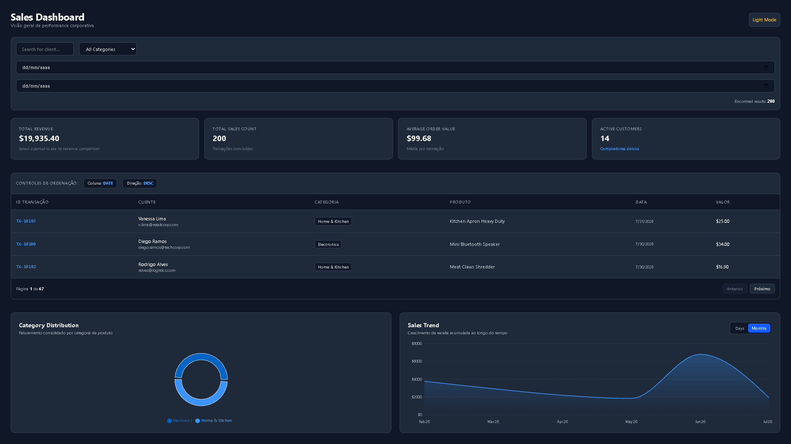
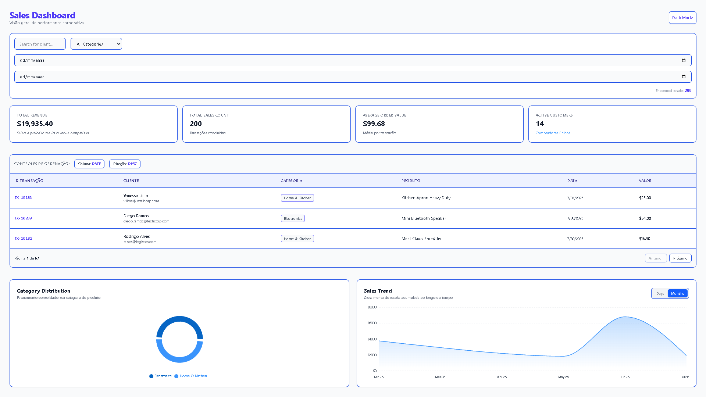

# Corporate Sales Dashboard & Analytics App

**A modern, reactive client-side analytics dashboard built with React 19, Vite, and Tailwind CSS, designed to process, filter, and visualize real-time corporate sales data.**

---

## The Problem
In fast-paced corporate environments, business decision-makers and sales teams struggle with key operational challenges when monitoring revenue metrics:
*   **Cluttered and Slow Analytics UIs:** Traditional reporting platforms are often bloated, slow to load, and require frequent server roundtrips for simple filtering or sorting operations.
*   **Tight Coupling of Business Logic:** In many front-end applications, state management, metric calculations, and UI components are mixed together, making the codebase fragile, hard to test, and difficult to scale.
*   **Lack of Granular Data Filtering:** Users frequently lack immediate, multidimensional tools to filter transactions concurrently by text search, product category, and date ranges without breaking active paginations or table sorts.
*   **Poor Visual Hierarchy & Accessibility:** Essential Executive KPIs (e.g., Total Revenue, Average Order Value, Active Customers, and period-over-period percentage comparisons) are often buried under unstructured tables without dark mode support or visual charts.

---

## The Solution
This project provides a highly responsive, single-page corporate dashboard driven by a custom React architecture. It abstracts all state manipulation, dynamic metrics calculation, and filter pipelines into a dedicated custom hook (`useSalesDashboard`), serving a clean, modern UI styled with Tailwind CSS v4 and Recharts.


* Dark Mode

---


* Light Mode

### What this tool automatically handles for you:
*   **Decoupled Architecture (`useSalesDashboard` Custom Hook):** Isolates state management, dynamic filtering algorithms, pagination, and multi-column sorting from the presentation layer (`App.jsx`).
*   **Real-Time Multidimensional Filtering:** Seamlessly combines live text queries (by client name), category dropdowns, and custom date range filters (`dateFirst` / `dateLast`).
*   **Executive KPI Calculation Engine:** Dynamically calculates top-level metrics in real time, including Total Revenue, Total Sales Count, Average Order Value (AOV), and Unique Active Customers.
*   **Period-over-Period Revenue Comparison:** Automatically compares revenue within the selected date filter against the equivalent preceding time window to display percentage growth or decline.
*   **Interactive Visualizations (Recharts):** Renders responsive Pie/Donut charts (Revenue distribution by Category, excluding refunded orders) and Area charts (Accumulated revenue trend over time).
*   **Advanced Data Table Management:** Includes client-side pagination with configurable page sizes, multi-column sorting (by Date and Amount in ascending/descending order), and status badges (`PAID`, `PENDING`, `REFUNDED`).
*   **Persistent Theme Switching:** Full Dark Mode and Light Mode support with seamless state persistence across browser reloads.

---

## Demonstrated Capabilities
Building this client-side analytics application demonstrates a strong understanding of modern React design patterns, performance-conscious state design, and visual presentation layer integrity:

*   **Clean Separation of Concerns:** Rigid architectural boundary separating business rules (custom hooks), mock datasets, utility helpers, and visual presentation components.
*   **Optimized Client-Side Data Processing:** Memoized filter pipelines and dynamic array aggregations that execute instantly without introducing UI jank or unneeded re-renders.
*   **Robust Component Design:** Reusable UI elements structured using Tailwind CSS utility classes, ensuring visual consistency across light and dark theme palettes.
*   **Declarative Visual Analytics Integration:** Seamless integration of Recharts, configuring custom tooltips, responsive containers, and dynamic color scales tuned for both light and dark backgrounds.

---

## Interface Specifications & Technical Walkthrough

This section details how data flows through the application hook pipeline, outlining key functions, data structures, and state management lifecycle.

### 1. Custom Hook & Core State Pipeline (`useSalesDashboard`)

The primary hook exposed to the application serves as the single source of truth for dashboard data.

#### Hook Parameters & Initialization
*   **Input:** Initial raw transactions array (`salesMock.json`).
*   **Exposed State Properties:**
    *   `searchTerm`: String value driving client-name text searches.
    *   `selectedCategory`: Selected product category filter (`All` or specific category).
    *   `dateFirst` / `dateLast`: ISO date strings defining the filter date range.
    *   `sortConfig`: Object defining sorting key (`date`, `amount`) and direction (`asc`, `desc`).
    *   `currentPage` / `itemsPerPage`: Client-side pagination state.
    *   `isDarkMode`: Boolean theme indicator.

#### Primary Computed Metrics Output
*   **`metrics` Object:**
    ```json
    {
      "totalRevenue": 48250.00,
      "totalSalesCount": 124,
      "averageOrderValue": 389.11,
      "activeCustomers": 89,
      "revenueGrowthPercentage": 14.5
    }
    ```

---

### 2. Transaction Data Schema

Data format consumed by the dashboard pipeline and processed by internal aggregators.

#### Transaction Object Structure
```json
{
  "id": "TX-1092",
  "clientName": "Acme Global Solutions",
  "category": "Software & Subscriptions",
  "amount": 1250.00,
  "status": "PAID",
  "date": "2026-09-18T14:32:00.000Z"
}
```
*   **Valid `status` Values:** `PAID`, `PENDING`, `REFUNDED`.
*   *Note: Transactions marked as `REFUNDED` are automatically excluded from revenue totals and chart calculations.*

---

## Project Architecture
```text
Corporate-dashboard-api/
├── public/                  # Public static assets and favicons
│   └── favicon.svg
├── src/
│   ├── assets/              # Icons and graphics
│   ├── data/                # Static data feeds and mock collections
│   │   └── salesMock.json   # Primary transaction dataset
│   ├── hooks/               # Custom React state hooks
│   │   └── useSalesDashboard.js # Central business logic & filtering engine
│   ├── utils/               # Pure helper functions
│   │   └── formatMoney.js   # Currency and date formatting utilities (Intl)
│   ├── App.jsx              # Main Dashboard UI component & layout grid
│   ├── index.css            # Tailwind CSS v4 directives and theme variables
│   └── main.jsx             # React DOM application entrypoint
├── eslint.config.js         # Linter rules and code quality configuration
├── index.html               # HTML5 base document template
├── package.json             # Scripts, dependencies, and project metadata
├── vite.config.js           # Vite build system and dev server config
└── README.md                # Project documentation
```